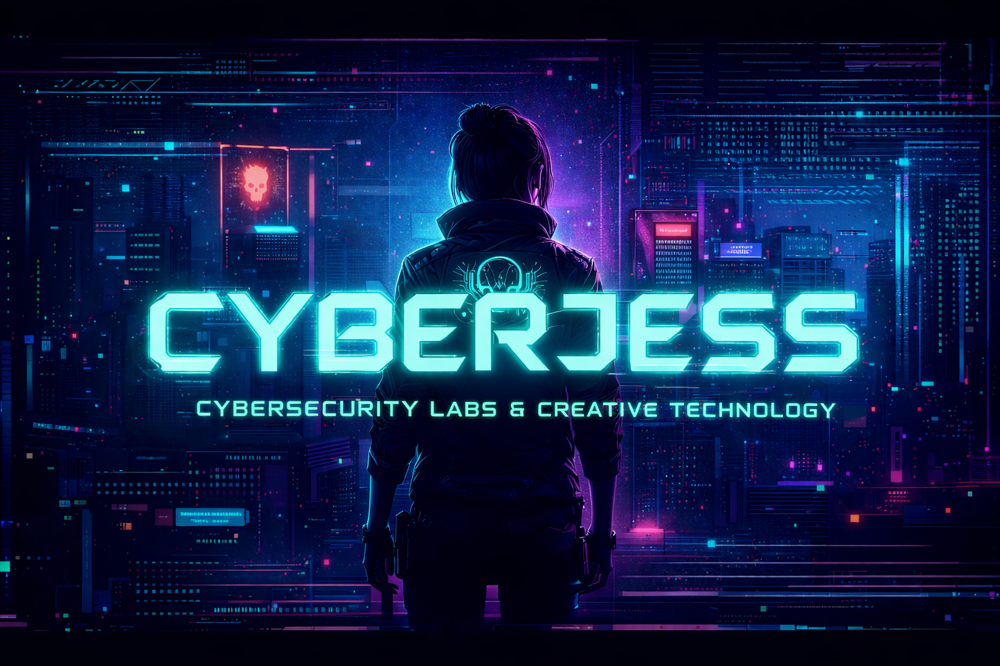

<p align="center">
  
</p>

<p align="center">
  <code>ACCESS GRANTED</code><br>
  <code>LOADING CYBERJESS-LAB...</code>
</p>

---

<h1 align="center">⚡ CYBERJESS // LAB</h1>

<p align="center">
  <i>"In a world of signals and noise, detection is survival."</i>
</p>

---

## 🧬 INIT

Welcome to **CyberJess-Lab** — a personal cybersecurity environment where defense meets offense, and theory meets hands-on experimentation.

This lab is a space to explore systems, analyze behavior, and understand how things break.

Built through curiosity, experimentation, and a constant drive to improve detection and analysis skills.

---

## 🛰️ OPERATIONS

This repository contains real-world inspired cybersecurity work:

- 🛡️ SOC investigations & threat hunting  
- 📡 Detection engineering (KQL / Microsoft Sentinel)  
- 🧪 Malware analysis & reverse engineering  
- 🎯 Offensive security & pentesting labs  
- 🎣 Phishing simulations  
- 🕹️ CTF challenges & writeups  
- ⚙️ Automation & scripting  

---

## 🧠 MINDSET

Cybersecurity is not just about alerts —  
it's about **understanding intent, patterns, and behavior**.

This lab is built on:

- learning through experimentation  
- thinking like an attacker  
- building resilient detection strategies  
- embracing complexity  

---

## 🧰 TOOLCHAIN

```diff
> initializing modules...
> detection systems: online
> network analysis: ready
> scripting environment: initialized
> status: operational
```
🛡️ Detection & Monitoring

Defender XDR • Microsoft Sentinel • KQL • Elastic Stack (Elasticsearch, Logstash, Kibana, Winlogbeat)

🌐 Network & Traffic Analysis

Wireshark • Zeek • Suricata • tcpdump • Firewall analysis • Network traffic inspection

💻 Systems & Scripting

Linux • Windows • PowerShell • Python 

🎯 Offensive & Labs

Pentesting Labs • CTF Platforms • Custom Scripts

⚙️ Automation & Workflow

n8n • API Integration • Automation

> Tools evolve. Mindset remains.

---
## 🗺️ TOOL MAP

```diff
> accessing external dashboard...
> loading cyberjess workspace...
> connection established
```

My cybersecurity environment is built around a constantly evolving ecosystem of tools, workflows, and resources.

🔗 **Personal dashboard**: [Start.me](https://start.me/p/ARen4w/start-page)

> Always evolving. Always refining.  


## 🔗 NETWORK

Specialized modules:

- 🛡️ KQL Detections → (coming soon)
- 🧪 Malware Analysis → (coming soon)
- 🎯 Pentest Labs → (coming soon)
- 🕹️ CTF Writeups → (coming soon)
- ⚙️ Automation → (coming soon)

---

## ⚠️ WARNING

All operations are conducted in **controlled environments**.  
No production or organizational data is exposed.

---

## 👾 IDENTITY

```diff
> identity loaded: cyberjess
> observing systems
> analyzing patterns
> challenging assumptions
> correlating signals
> detecting anomalies
> understanding behavior
> refining continuously  
```

---

## 🌌 STATUS

```diff
> Lab active.  
> Signals monitored.  
> Threats evolving.
```
